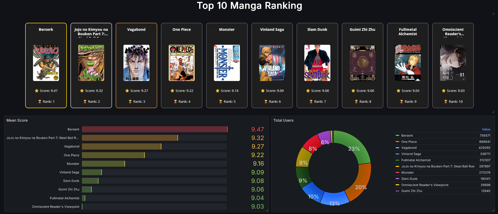

# 📊 MyAnimeList Manga Monitoring

A Zabbix + Grafana solution to monitor the Top 10 manga rankings from MyAnimeList using the official MAL API.

## ✨ Features

- Zabbix Low-Level Discovery (LLD) for top manga
- Real-time data via Zabbix HTTP Agent
- Grafana dashboard with HTMLGraphics card display
- Score, rank, and cover image monitoring
- Visual highlight for top 3 manga (gold/silver/bronze)
- Responsive layout and scroll support

## 📦 Project Structure

| Path                    | Description                       |
|-------------------------|-----------------------------------|
| `zabbix/`               | Zabbix template with LLD and items |
| `dashboard/`            | Grafana dashboard JSON            |
| `scripts/render.js`     | JavaScript for HTML card rendering |
| `scripts/style.css`     | Custom CSS for cards              |
| `assets/screenshots/`   | Preview images                    |

## 🧰 Requirements

- Zabbix 7.0+
- MyAnimeList API Client ID (`{$CLIENT_ID}`)
- Grafana + HTMLGraphics Panel plugin
- Internet access for Zabbix HTTP Agent

## 📸 Preview

## 📜 License

This project is licensed under the MIT License - see the [LICENSE](LICENSE) file for details.

